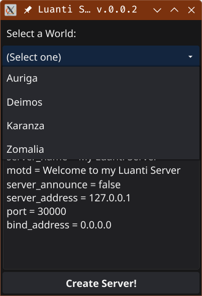
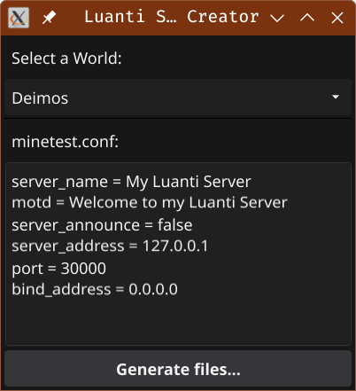
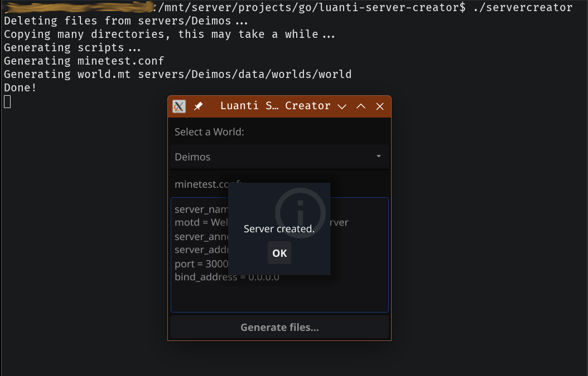

# Luanti Server Creator

Para crear un servidor de Luanti en Docker con 2 clicks de ratón.

## Cómo usar
En el equipo que hará de servidor, tendréis que tener instalado Docker.

Usuarios de Windows: Para ese Sistema Operativo, la aplicación está en fase **totalmente experimental**, yo no uso Windows y aunque he procurado programarlo multiplataforma y lo he compilado para Windows, no he podido probarlo personalmente, así que no puedo asegurar que funcione.


### Descargar
Si no quieres compilarlo por ti mismo, descarga los ejecutables que están en el directorio `bin/` del repositorio. `servercreator` para Linux y `servercreator.exe` para Windows. Crea un directorio en el disco donde quieras guardar el servidor o los servidores y copia ahí el `servercreator`.

### Desde el cliente del juego
1. (Opcional) Crea un nuevo mundo del tipo de juego que se quiera (minetest, mineclone, ...). `Importante`, aunque sea opcional este paso, es recomendable lanzar el servidor con un mundo nuevo.
2. (Opcional) Activarle los mods que se quieran usar.

### Lanzamos la aplicación
Es recomendable hacerlo desde la linea de comandos para ver los posibles mensajes de error.
1. En el desplegable, seleccionamos nuestro mundo.
 
   

3. Edita las lineas del fichero de configuración del servidor adaptadas a tus necesidades, no necesitan mucha explicación.

   

4. Pulsamos `Generar ficheros`. Se generarán todos los ficheros necesarios dentro del directorio de la aplicación con el nombre del mundo. Por ejemplo, si el mundo se llama Deimos, se creará dentro de `<app path>/servers/Deimos/`.

   

### Usar el contenedor
Si seguimos con el ejemplo anterior vemos los ficheros creados
```bash
$ cd servers/Deimos && ls
start-server.sh
start-server.bat
stop-server.sh
stop-server.bat
data/
```
Los archivos con extesión `.sh` son de Linux y los `.bat` de Windows.

1. Lanza el contenedor con `start-server.sh` y conéctate, no hay más que explicar. La primera vez se tendrá que descargar y generar la imagen y tardará un poco más. Esto sólo sucedera una vez.
2. Si quieres parar el contenedor de forma segura, puedes hacer un comando `/shutdown` desde el cliente, o bien ejecutar `stop-server.sh`.

## Caveats and gotchas

**El servidor crashea con algunos mods como Animalia o 3DArmor**. Estoy trabajando en ello y espero encontrar una solución pronto.

La ruta por defecto que busca para los mapas es `~/.minetest`. Si tus ficheros no están en ese directorio, crea un fichero `config.ini` en el directorio de la aplicación con el siguiente contenido:
```ini
data_path = /your/path/to/data
```
Usuarios de Windows: estais obligados a crear este fichero con vuestra ruta.

***
Usuarios de Windows: Es posible que tengáis que darle permisos al directorio para compartirlo. Docker Desktop > Settings > Resources > File Sharing.
***
Los nombres de los mundos serán `sanitizados`: Convertidos a minúsculas y reemplazando caracteres especiales a `_`. **Esto sólo afecta internamente al nombre de los contenedores**. Sin embargo, nombre parecidos como `King Realm@` y `king realm!` serán convertidos al mismo nombre `king_realm_`, lo que hará que el último acabe sobrescribiendo el anterior.

***
Si el servidor no se lanza, elimina la opción `-d` de `start-server.sh` para entrar en el modo interactivo y ver los mensajes (`CTRL-C` salir).
