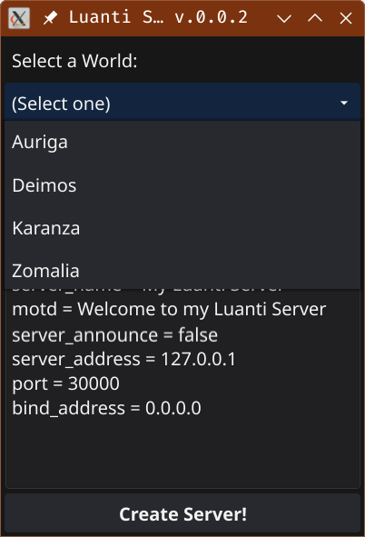
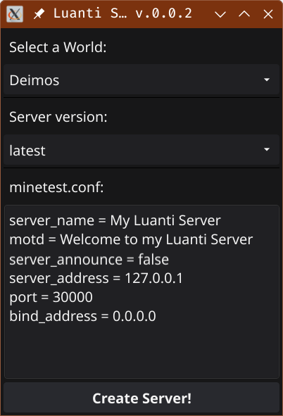
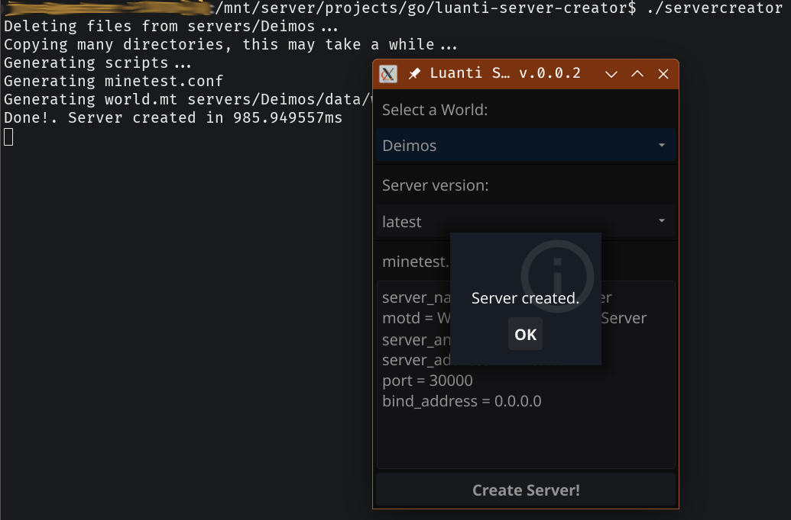

# Luanti Server Creator

A tool to create a Luanti server in Docker with just two clicks.

## How to Use
You need to have Docker installed on the computer that will act as the server.

Windows Users: For this operating system, the application is in a **completely experimental** phase. I don't use Windows, and while I have tried to make it cross-platform and compiled it for Windows, I haven't been able to test it personally, so I cannot guarantee it will work.

### Download
If you don’t want to compile it yourself, download the executables located in the `bin/` directory of the repository. Use `servercreator` for Linux and `servercreator.exe` for Windows. Create a directory on your disk where you want to save the server(s) and copy the `servercreator` there.

### From the Game Client
1. (Optional) Create a new world using the desired game type (minetest, mineclone, ...). **Important**: While optional, it is recommended to launch the server with a new world.
2. (Optional) Enable any mods you want to use.

### Launch the Application
It’s recommended to run it from the command line to view potential error messages.

1. In the dropdown menu, select your world.

   

2. Edit the server configuration file lines as needed; they don’t require much explanation.

   

3. Click `Generate Files`. All necessary files will be generated in the application directory under the world’s name. For example, if the world is called "Deimos", it will be created within `<app path>/servers/Deimos/`.

   

### Using the Container
If we continue with the previous example, let’s check the generated files:
```bash
$ cd servers/Deimos && ls
start-server.sh
start-server.bat
stop-server.sh
stop-server.bat
data/
```
Files with the `.sh` extension are for Linux, and `.bat` are for Windows.

1. Launch the container with `start-server.sh` and connect to it. There’s nothing more to explain. The first time, the image will need to be downloaded and built, so it will take a bit longer. This only happens once.
2. To safely stop the container, you can issue the `/shutdown` command from the client or execute `stop-server.sh`.

## Caveats and Gotchas

The default path for maps is `~/.minetest`. If your files are not in this directory, create a `config.ini` file in the application directory with the following content:
```ini
data_path = /your/path/to/data
```
Windows Users: You are required to create this file with your path.

***
Windows Users: You may need to grant permissions to the directory to share it. Go to Docker Desktop > Settings > Resources > File Sharing.
***

World names will be **sanitized**: Converted to lowercase and special characters replaced with `_`. **This only affects the internal container names**. However, similar names like `King Realm@` and `king realm!` will be converted to the same name `king_realm_`, causing the latter to overwrite the former.

***
If the server doesn’t start, remove the `-d` option from `start-server.sh` to enter interactive mode and view messages (`CTRL-C` to exit).
